* [Working directory]{color="#4f0943"} on EBI Codon HPC: `/hps/nobackup/birney/users/ian/hmn_fst`
* [GitHub repository]{color="#4f0943"}: <https://github.com/brettellebi/human_traits_fst>


# Source libraries, functions and plotting parameters


```r
library(here)

source(here::here("code", "scripts", "source.R"))
```

# Gather and process 1KG VCFs and GWAS Catalog data

Full Snakemake pipeline here: <https://github.com/brettellebi/human_traits_fst/tree/master/code/snakemake/20210416>


```bash
cd /hps/software/users/birney/ian/repos/human_traits_fst
conda activate snakemake
sing_load
snmk_proj="20210416"

snakemake \
  --jobs 5000 \
  --latency-wait 500 \
  --cluster-config code/snakemake/$snmk_proj/config/cluster.json \
  --cluster 'bsub -g /snakemake_bgenie -J {cluster.name} -n {cluster.n} -M {cluster.memory} -o {cluster.output} -e {cluster.error}' \
  --keep-going \
  --rerun-incomplete \
  --use-conda \
  --use-singularity \
  -s code/snakemake/$snmk_proj/Snakefile \
  -p
```

# Read in data and process


```r
# Variables
gcat_traits = gwasrapidd::get_traits(efo_trait = target_traits)
trait_ids = gcat_traits@traits$efo_id
names(trait_ids) = trait_ids
target_dir = here::here("data/gwasrapidd/20210525")

# Read in raw associations objects
assocs_raw = lapply(trait_ids, function(TRAIT_ID){
  readRDS(file.path(target_dir, "associations_raw", paste(TRAIT_ID, ".rds", sep = "")))
})

# Read in raw studies objects
studies_raw = lapply(trait_ids, function(TRAIT_ID){
  readRDS(file.path(target_dir, "studies_raw", paste(TRAIT_ID, ".rds", sep = "")))
})

# Read in association-study key
studies_key = lapply(trait_ids, function(TRAIT_ID){
  readRDS(file.path(target_dir, "studies_key", paste(TRAIT_ID, ".rds", sep = "")))  
})

# Read in genotypes from VCFs
genos_raw = lapply(trait_ids, function(TRAIT_ID){
  path = file.path(target_dir, "vcfs", paste(TRAIT_ID, ".vcf.gz", sep = ""))
  n_variants = nrow(pegas::VCFloci(path))
  pegas::read.vcf(path, to = n_variants)
})

# Read in loci from VCFs
loci_info = lapply(trait_ids, function(TRAIT_ID){
  out = pegas::VCFloci(file.path(target_dir, "vcfs", paste(TRAIT_ID, ".vcf.gz", sep = "")))
  out %>%
    dplyr::mutate(CHROM = as.double(CHROM))
})

# Create vector of populations
## Read in population file
pop_file = readr::read_csv(here::here("data/1kg_populations.csv"))
## Create vector of populations
populations = unlist(lapply(rownames(genos_raw[[1]]), function(sample){
    pop_file$Population[pop_file$Sample == sample]
}))
## Create data frame with just 2,504 individuals
pops_1kg = pop_file %>% 
  dplyr::filter(Sample %in% rownames(genos_raw[[1]]))

# Read in clumped SNPs
clumped = lapply(trait_ids, function(TRAIT_ID){
  readr::read_delim(file.path(target_dir, "plink/clumped", paste(TRAIT_ID, ".clumped", sep = "")),
                    delim = " ", trim_ws = T)
})

# Read in 012 genotypes
genos_012 = lapply(trait_ids, function(TRAIT_ID){
  readr::read_tsv(file.path(target_dir, "plink/recode_012", paste(TRAIT_ID, ".traw", sep = ""))) %>% 
    # rename columns to remove duplicated ID
    dplyr::rename_with(~str_split(.x, pattern = "_", simplify = T) %>% 
                       subset(select = 1),
                       .cols = matches("_"))
})

# Read in Plink Fst
fst_plink = lapply(trait_ids, function(TRAIT_ID){
  readr::read_tsv(file.path(target_dir, "plink/fst", paste(TRAIT_ID, ".fst", sep = "")))
})
```

## Counts

How many unique SNPs in datasets?


```r
# How many unique SNPs in associations?
raw_assocs_count = purrr::map(assocs_raw, function(TRAIT_ID){
  TRAIT_ID@risk_alleles %>% 
    dplyr::select(variant_id)
}) %>% 
  dplyr::bind_rows(.id = "efo_id") %>% 
  dplyr::left_join(.,
                   gcat_traits@traits,
                   by = "efo_id") %>% 
  # combine various pigmentation traits
  dplyr::mutate(TRAIT = dplyr::recode(trait, !!!pig_recode_vec),
                TRAIT = factor(TRAIT, levels = extended_traits)) %>% 
  dplyr::group_by(TRAIT) %>% 
  dplyr::distinct(variant_id) %>% 
  dplyr::count(name = "N_ASSOCS")

#How many unique SNPs in VCFs
purrr::map(loci_info, function(TRAIT_ID){
  TRAIT_ID %>% 
    dplyr::select(ID)
}) %>% 
  dplyr::bind_rows(.id = "efo_id") %>% 
  dplyr::left_join(.,
                   gcat_traits@traits,
                   by = "efo_id") %>% 
  dplyr::mutate(TRAIT = dplyr::recode(trait, !!!pig_recode_vec),
                TRAIT = factor(TRAIT, levels = extended_traits)) %>% 
  dplyr::group_by(TRAIT) %>% 
  dplyr::distinct(ID) %>% 
  dplyr::count(name = "N_VCF") %>% 
  # bind with raw assocs counts
  dplyr::left_join(raw_assocs_count,
                   .,
                   by = "TRAIT") %>% 
  # Order and add column with percentage
  dplyr::mutate(PERC_RETREIVED = N_VCF / N_ASSOCS) %>% 
  dplyr::arrange(.by_group = T) %>% 
  knitr::kable(.)
```


|TRAIT                                           | N_ASSOCS| N_VCF| PERC_RETREIVED|
|:-----------------------------------------------|--------:|-----:|--------------:|
|body height                                     |     4938|  4804|      0.9728635|
|body mass index                                 |     4262|  4177|      0.9800563|
|self reported educational attainment            |     3387|  3360|      0.9920283|
|intelligence                                    |     2595|  2558|      0.9857418|
|inflammatory bowel disease                      |      411|   399|      0.9708029|
|all pigmentation                                |     1203|  1054|      0.8761430|
|schizophrenia                                   |     2571|  2350|      0.9140412|
|unipolar depression                             |     1794|  1747|      0.9738016|
|fasting blood glucose measurement               |      200|   198|      0.9900000|
|myocardial infarction                           |      276|   272|      0.9855072|
|low density lipoprotein cholesterol measurement |     1504|  1319|      0.8769947|
|platelet count                                  |     1851|  1728|      0.9335494|


## Calculate Fst with `pegas`


```r
fst_pegas = lapply(genos_raw, function(TRAIT_ID){
  pegas::Fst(TRAIT_ID, pop = populations)
})
```


# Plot $F_{ST}$

## Bind relevant data


```r
fst_pegas_df = lapply(trait_ids, function(TRAIT_ID){
  # Loci info
  loci = loci_info[[TRAIT_ID]] %>% 
    dplyr::select(CHROM, POS, ID, REF, ALT)
  # Risk alleles
  risk_alleles = assocs_raw[[TRAIT_ID]]@risk_alleles %>% 
    dplyr::select(association_id, variant_id, risk_allele)
  # Study key
  study_key = studies_key[[TRAIT_ID]]
  # Studies
  studies = studies_raw[[TRAIT_ID]]@studies %>% 
    dplyr::select(study_id, initial_sample_size, replication_sample_size)
  # Fst
  fst = fst_pegas[[TRAIT_ID]] %>%
    data.frame(.) %>% 
    tibble::rownames_to_column(var = "ID") %>% 
    dplyr::select(ID, FST_PEGAS = Fst)
  
  # Bind all
  out = dplyr::left_join(loci, risk_alleles, by = c("ID" = "variant_id")) %>% 
    dplyr::left_join(study_key, by = "association_id") %>% 
    dplyr::left_join(studies, by = "study_id") %>% 
    dplyr::left_join(fst, by = "ID")
}) %>% 
  dplyr::bind_rows(.id = "EFO_ID") %>%
  # Add `trait` for each `efo_id` from `gcat_traits` key
  dplyr::left_join(gcat_traits@traits %>% 
                     dplyr::select(efo_id, trait),
                   by = c("EFO_ID" = "efo_id")) %>% 
  dplyr::select(EFO_ID, trait, everything()) %>% 
  # Recode Pigmentation traits
  dplyr::mutate(TRAIT = dplyr::recode(trait, !!!pig_recode_vec)) %>% 
  # Factorise to order
  dplyr::mutate(TRAIT = factor(TRAIT, levels = extended_traits))

# Create a second df with clumped SNPs
## Get clumped SNPs
clumped_snps = lapply(clumped, function(TRAIT_ID) {
  TRAIT_ID %>%
    dplyr::pull(SNP)
}) %>% purrr::flatten_chr()
## Create list and bind
fst_pegas_df_clumps= list(
  "ALL" = fst_pegas_df,
  "CLUMPED" = fst_pegas_df %>% 
    dplyr::filter(ID %in% clumped_snps)
) %>% 
  dplyr::bind_rows(.id = "FILTER")

# How many unique SNPs in total (having grouped by TRAIT)
fst_pegas_df_clumps %>% 
  dplyr::filter(FILTER == "ALL") %>% 
  dplyr::group_by(TRAIT) %>% 
  dplyr::distinct(ID) %>% 
  nrow()
```

```
## [1] 23966
```

```r
# How many unique SNPs in total after clumping (having grouped by TRAIT)
fst_pegas_df_clumps %>% 
  dplyr::filter(FILTER == "CLUMPED") %>% 
  dplyr::group_by(TRAIT) %>% 
  dplyr::distinct(ID) %>% 
  nrow()
```

```
## [1] 10221
```


## Initial counts of variants


```r
fst_pegas_df_clumps %>%
  # group by FILTER and TRAIT to take unique SNPs within each group
  dplyr::group_by(FILTER, TRAIT) %>% 
  # take unique IDs
  dplyr::distinct(ID, .keep_all = T) %>% 
  # ungroup
  dplyr::ungroup() %>% 
  # plot
  ggplot() +
    geom_bar(aes(TRAIT, fill = TRAIT)) +
    scale_fill_manual(values = pal_primary_new) +
    theme_bw() +
    theme(axis.text.x = element_blank(),
          axis.title.x = element_blank(),
          axis.ticks.x = element_blank()) +
    ylab("N loci") +
    facet_wrap(~FILTER, nrow = 2)
```

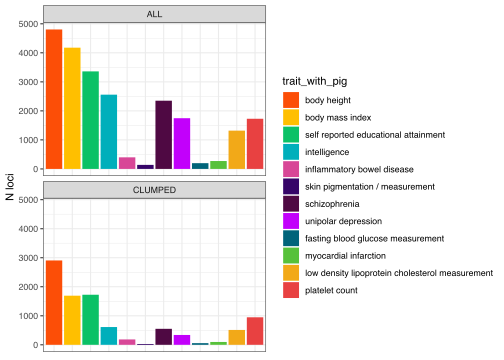<!-- -->

### $F_{ST}$

#### Pegas


```r
fst_pegas_df_clumps %>% 
  # filter for clumped index SNPs
  dplyr::filter(FILTER == "CLUMPED") %>% 
  # group by TRAIT to take unique SNPs
  dplyr::group_by(TRAIT) %>% 
  # take unique IDs
  dplyr::distinct(ID, .keep_all = T) %>%
  # reverse order of traits to put `body height` at the top
  dplyr::mutate(TRAIT = factor(TRAIT, levels = rev(extended_traits))) %>%
  # plot
  ggplot(aes(FST_PEGAS, TRAIT, fill = TRAIT, colour = TRAIT)) +
    geom_density_ridges(scale = 2,
                        bandwidth = 0.003,
                        calc_ecdf = TRUE,
                        quantiles = c(0.5, 0.9),
                        quantile_lines = T,
                        jittered_points = TRUE,
                        point_shape = '|', alpha = 0.85, point_size = 2,
                        position = position_points_jitter(width = 0.01, height = 0)) +
  scale_fill_manual(values = pal_primary_new) +
  scale_colour_manual(values = karyoploteR::darker(pal_primary_new)) +
  guides(fill = F, colour = F) +
  theme_bw() +
  scale_y_discrete(expand = expansion(add = c(0.2, 2.3))) +
  ylab(NULL) +
  ggtitle("Median and 90%") 
```

```
## Warning: Removed 1 rows containing non-finite values (stat_density_ridges).
```

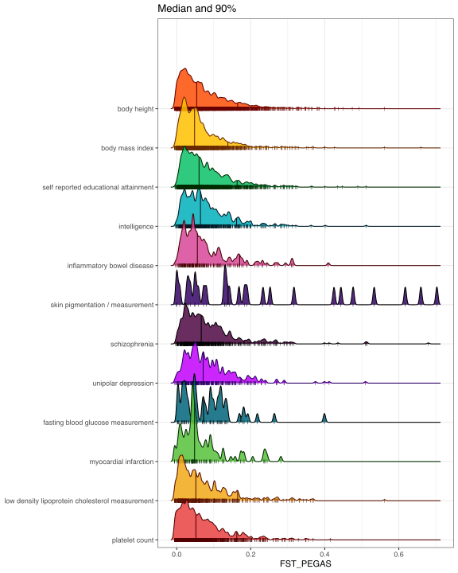

#### Plink


```r
# How many unique SNPs in Fst Plink output?
fst_plink %>% 
  dplyr::bind_rows(.id = "TRAIT") %>% 
  dplyr::group_by(TRAIT) %>% 
  dplyr::distinct(SNP) %>% 
  nrow()
```

```
## [1] 24083
```

```r
# Bind Plink outputs `fst_pegas_df_clump`
fst_all_df = fst_plink %>% 
  dplyr::bind_rows() %>% 
  # rename columns for ease of binding
  dplyr::select(ID = SNP, FST_PLINK = FST) %>% 
  # take distinct
  dplyr::distinct(ID, .keep_all = T) %>% 
  # bind with `fst_pegas_df_clumped`
  dplyr::left_join(fst_pegas_df_clumps,
                   .,
                   by = "ID")

# Plot correlation between pegas and Plink Fst
fst_all_df %>% 
  dplyr::filter(FILTER == "CLUMPED") %>% 
  ggplot() +
    geom_point(aes(FST_PEGAS, FST_PLINK, colour = TRAIT),
               alpha = 0.2)+
    theme_bw() +
    scale_colour_manual(values = pal_primary_new) +
    coord_fixed()
```

```
## Warning: Removed 1 rows containing missing values (geom_point).
```


### $F_{ST}$ for 3 populations (CEU, CHS, YRI)


```r
target_3_pops = c("YRI", "CEU", "CHS")

# Get list of samples from the 3 target populations
pops_3_pops = pops_1kg %>% 
  dplyr::filter(Population %in% target_3_pops)
```


```r
# Get Fst
fst_3_pops = lapply(genos_raw, function(TRAIT_ID){
  genos_filt = TRAIT_ID[rownames(TRAIT_ID) %in% pops_3_pops$Sample, ]
  pegas::Fst(TRAIT_ID, pop = populations)
})
```


```r
fst_3_pops_df = fst_3_pops %>% 
  purrr::map(., . %>% 
               data.frame(.) %>% 
               tibble::rownames_to_column(var = "ID") %>% 
               dplyr::select(ID, FST_PEGAS_3_POPS = Fst)) %>% 
  dplyr::bind_rows() %>% 
  dplyr::distinct(ID, .keep_all = T) %>% 
  dplyr::left_join(.,
                   fst_all_df,
                   by = "ID")
```


```r
fst_3_pops_df %>% 
  dplyr::filter(FILTER == "CLUMPED") %>%  # filter for clumped index SNPs
  # group by TRAIT to take unique SNPs
  dplyr::group_by(TRAIT) %>% 
  # take unique IDs
  dplyr::distinct(ID, .keep_all = T) %>%
  # reverse order of traits to put `body height` at the top
  dplyr::mutate(TRAIT = factor(TRAIT, levels = rev(extended_traits))) %>% 
  # plot
  ggplot(aes(FST_PEGAS_3_POPS, TRAIT, fill = TRAIT, colour = TRAIT)) +
    geom_density_ridges(scale = 2,
                        bandwidth = 0.003,
                        calc_ecdf = TRUE,
                        quantiles = c(0.5, 0.9),
                        quantile_lines = T,
                        jittered_points = TRUE,
                        point_shape = '|', alpha = 0.85, point_size = 2,
                        position = position_points_jitter(width = 0.01, height = 0)) +
  scale_fill_manual(values = pal_primary_new) +
  scale_colour_manual(values = karyoploteR::darker(pal_primary_new)) +
  guides(fill = F, colour = F) +
  theme_bw() +
  scale_y_discrete(expand = expansion(add = c(0.2, 2.3))) +
  ylab(NULL) +
  ggtitle("Median and 90%") 
```

```
## Warning: Removed 1 rows containing non-finite values (stat_density_ridges).
```


# 012 Histograms per population

Process data


```r
increase_allele_counts = lapply(trait_ids, function(TRAIT_ID){
  
  # Get risk allele and direction
  out = dplyr::left_join(assocs_raw[[TRAIT_ID]]@associations %>% 
              dplyr::select(association_id, pvalue, beta_direction),
            assocs_raw[[TRAIT_ID]]@risk_alleles %>% 
              dplyr::select(association_id, variant_id, risk_allele),
            by = "association_id") %>% 
    # Filter for clumped SNPS
    dplyr::filter(variant_id %in% clumped[[TRAIT_ID]]$SNP) %>% 
    # Bind with 012 genotypes
    left_join(.,
              genos_012[[TRAIT_ID]],
              by = c("variant_id" = "SNP")) %>% 
    # Find whether the risk allele is COUNTED or ALT in 012 genotypes
    dplyr::mutate(RISK_ALLELE = dplyr::case_when(
      risk_allele == COUNTED ~ "counted",
      risk_allele == ALT ~ "alt",
      TRUE ~ NA_character_
      )
    ) %>% 
    # Specify the "increase" allele to count 
    dplyr::mutate(TO_COUNT = dplyr::case_when(
      beta_direction == "increase" & RISK_ALLELE == "counted" ~ "COUNTED",
      beta_direction == "increase" & RISK_ALLELE == "alt" ~ "ALT",
      beta_direction == "decrease" & RISK_ALLELE == "counted" ~ "ALT",
      beta_direction == "decrease" & RISK_ALLELE == "alt" ~ "COUNTED",
      TRUE ~ NA_character_
      )
    ) %>% 
    # Swap counts if TO_COUNT == "ALT". This leaves the genotype as NA if TO_COUNT is NA
    dplyr::mutate(dplyr::across(all_of(pops_1kg$Sample),
                                ~dplyr::case_when(
                                  TO_COUNT == "ALT" ~ dplyr::recode(.x,
                                                                    `0` = 2,
                                                                    `2` = 0),
                                  TO_COUNT == "COUNTED" ~ .x,
                                  ))) %>% 
  # Pivot longer and get allele counts
    tidyr::pivot_longer(cols = all_of(pops_1kg$Sample),
                        names_to = "SAMPLE",
                        values_to = "INCREASE_ALLELE_COUNT") %>% 
    # add population
    dplyr::inner_join(.,
                     pops_1kg,
                     by = c("SAMPLE" = "Sample")) %>% 
    # factor `Population` to order
    dplyr::mutate(Population = factor(Population, levels = names(onekg_pal))) %>% 
    # factor `INCREASE_ALLELE_COUNT` to order
    dplyr::mutate(INCREASE_ALLELE_COUNT = factor(INCREASE_ALLELE_COUNT, levels = c(0:2, NA))) %>% 
    # Remove duplicate SNPs
    ## First those with NA in `TO_COUNT`
#    dplyr::filter((duplicated(.$variant_id) == F | duplicated(.$variant_id, fromLast = T)) & is.na(TO_COUNT)) %>%
    ## Then other duplicates
#    dplyr::distinct(variant_id, .keep_all = T) %>% 
    # Get per-population counts of 0,1,2, and NA
    dplyr::group_by(Population) %>% 
    dplyr::count(INCREASE_ALLELE_COUNT) %>% 
    dplyr::ungroup()
  return(out)
})
```

Plot 

## Counts including NAs 

To show the number of SNPs for which direction of effect was unavailable.


```r
increase_allele_counts %>% 
  dplyr::bind_rows(.id = "efo_id") %>% 
  dplyr::left_join(.,
                   gcat_traits@traits %>% 
                     dplyr::select(efo_id, trait),
                   by = "efo_id") %>% 
  dplyr::mutate(TRAIT = dplyr::recode(trait, !!!pig_recode_vec),
                TRAIT = factor(TRAIT, levels = extended_traits)) %>% 
  dplyr::group_by(TRAIT) %>% 
  dplyr::group_map(
    ~ggplot(.x) +
      geom_col(aes(INCREASE_ALLELE_COUNT, n, fill = Population)) +
      facet_wrap(~Population) +
      scale_fill_manual(values = onekg_pal) +
      theme_bw() +
      ggtitle(unique(.x$TRAIT)) + 
      guides(fill = F) +
      xlab("Count of allele associated with increase in trait"),
  .keep = T)
```

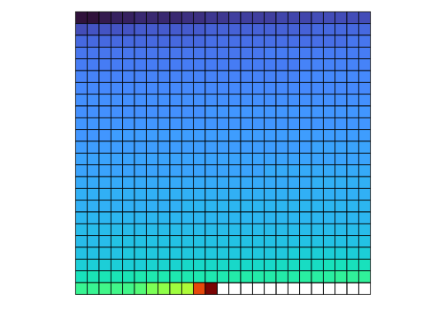<!-- -->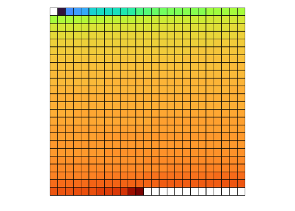<!-- --><!-- --><!-- --><!-- --><!-- --><!-- --><!-- --><!-- --><!-- --><!-- --><!-- -->

## Counts excluding NAs 

Now showing counts as proportions


```r
increase_allele_counts %>% 
  dplyr::bind_rows(.id = "efo_id") %>% 
  # add trait names
  dplyr::left_join(.,
                   gcat_traits@traits %>% 
                     dplyr::select(efo_id, trait),
                   by = "efo_id") %>% 
  # combine pigmentation traits and order traits
  dplyr::mutate(TRAIT = dplyr::recode(trait, !!!pig_recode_vec),
                TRAIT = factor(TRAIT, levels = extended_traits)) %>% 
  # remove NAs
  dplyr::filter(!is.na(INCREASE_ALLELE_COUNT)) %>% 
  # group by population and calculate proportions
  dplyr::group_by(Population, TRAIT) %>% 
  dplyr::mutate(FREQ = n / sum(n)) %>% 
  dplyr::ungroup(Population) %>% 
  # Plot for each TRAIT
  dplyr::group_map(
    ~ggplot(.x) +
      geom_col(aes(INCREASE_ALLELE_COUNT, FREQ, fill = Population)) +
      facet_wrap(~Population) +
      scale_fill_manual(values = onekg_pal) +
      theme_bw() +
      ggtitle(unique(.x$TRAIT)) + 
      guides(fill = F) +
      xlab("Count of allele associated with increase in trait"),
  .keep = T)
```

<!-- --><!-- --><!-- --><!-- --><!-- --><!-- --><!-- --><!-- --><!-- --><!-- -->

## $F_{ST}$ of component traits of `all pigmentation`


```r
fst_pegas_df_clumps %>% 
  # filter for clumped index SNPs
  dplyr::filter(FILTER == "CLUMPED") %>% 
  # filter for pigmentation traits
  dplyr::filter(TRAIT == "all pigmentation") %>% 
  # group by `trait` to take unique SNPs
  dplyr::group_by(trait) %>% 
  # take unique IDs
  dplyr::distinct(ID, .keep_all = T) %>%
  # factorise `trait` to order
  dplyr::mutate(trait = factor(trait, levels = pig_traits)) %>%
  # plot
  ggplot(aes(FST_PEGAS,
           colour = TRAIT,
           fill = TRAIT)) +
    geom_histogram(bins = 50) +
    facet_wrap(~trait, ncol = 1) +
    scale_fill_manual(values = pal_primary_new) +
    scale_colour_manual(values = karyoploteR::darker(pal_primary_new)) +
    guides(fill = F, colour = F) +
    theme_bw() +
    ylab("count") #+
```

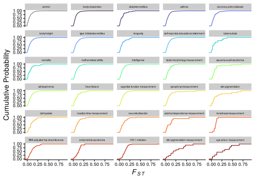

```r
#  ggtitle("Median and 90%") 
```

## $F_{ST}$ of SNPs discovered in different studies


```r
# How many studies contributed to pigmentation traits?
fst_pegas_df_clumps %>% 
  # filter for clumped index SNPs
  dplyr::filter(FILTER == "CLUMPED") %>% 
  # filter for pigmentation traits
  dplyr::filter(TRAIT == "all pigmentation") %>% 
  # factorise `trait` to order
  dplyr::mutate(trait = factor(trait, levels = pig_traits)) %>%
  # count studies for each trait
  dplyr::group_by(trait) %>% 
  dplyr::distinct(study_id) %>% 
  dplyr::summarise(N_STUDIES = dplyr::n())

# Plot  
fst_pegas_df_clumps %>% 
  # filter for clumped index SNPs
  dplyr::filter(FILTER == "CLUMPED") %>% 
  # filter for pigmentation traits
  dplyr::filter(TRAIT == "all pigmentation") %>% 
  # factorise `trait` to order
  dplyr::mutate(trait = factor(trait, levels = pig_traits)) %>%
  # group by `trait` to take unique SNPs
  dplyr::group_by(trait) %>% 
  # take unique IDs
#  dplyr::distinct(ID, .keep_all = T) %>% 
  # Plot for each `trait`
  dplyr::group_map(
    ~ ggplot(.x, aes(FST_PEGAS,
                     colour = TRAIT,
                     fill = TRAIT)) +
        geom_histogram(bins = 50) +
        facet_wrap(~initial_sample_size, ncol = 1) +
        scale_fill_manual(values = pal_primary_new) +
        scale_colour_manual(values = karyoploteR::darker(pal_primary_new)) +
        guides(fill = F, colour = F) +
        theme_bw() +
        ylab("count") +
        ggtitle(unique(.x$trait)),
  .keep = T)
```

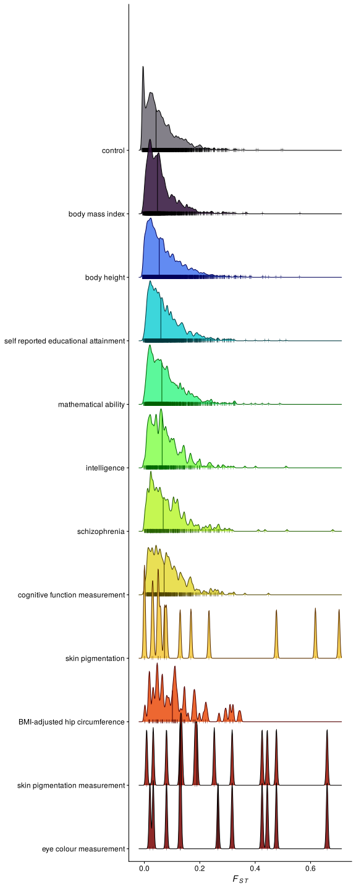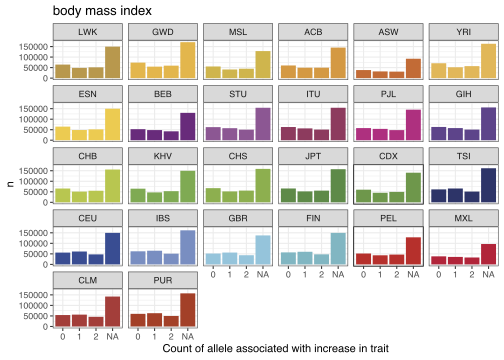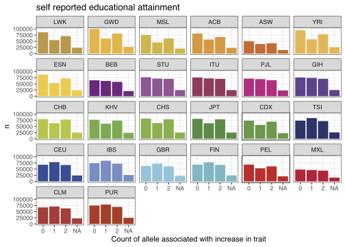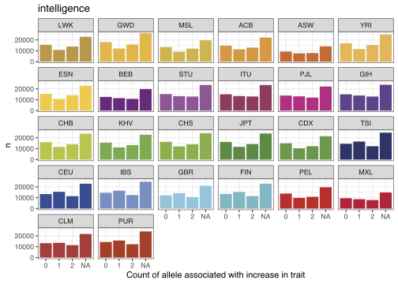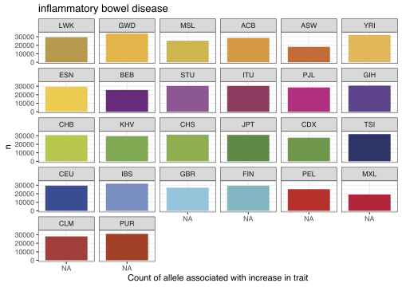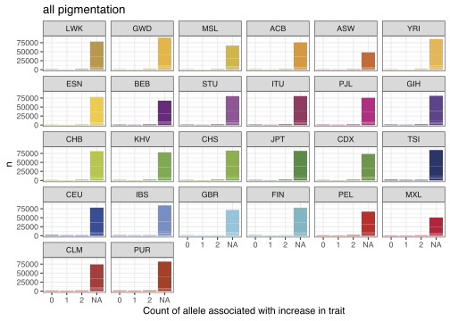


